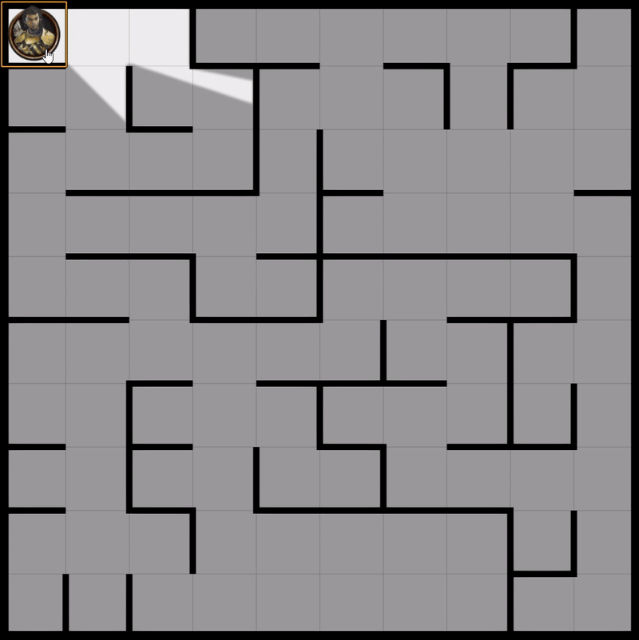

# Anyfinder for Foundry VTT

[](https://foundryvtt.com/)
[](./module.json)
[](./LICENSE)
[](https://raw.githubusercontent.com/apoapostolov/Anyfinder-for-Foundry-VTT/main/module.json)
[](https://github.com/apoapostolov/Anyfinder-for-Foundry-VTT/issues)

System-agnostic pathfinding for Foundry VTT v14.
Drag tokens and Anyfinder computes the shortest legal route around walls —
on square grids, hex grids, and gridless maps.



## What It Does

- Wraps token movement to compute shortest legal routes instead of straight drag lines.
- Respects wall constraints and updates routing when walls are added, moved, or deleted.
- Supports optional fog-of-war exploration restriction.
- Works on square grids, hex grids, and gridless maps.
- System-agnostic — not tied to PF2e, DnD5e, or any single ruleset.

## Features

- **On by default** — `Force Pathfinding for All Players` is enabled out of the box.
- **Per-user toggle** — Players can toggle pathfinding via the compass icon in token controls or `Shift+P`.
- **Hex grid wall awareness** — Detects phantom waypoints and wall-crossing routes, preferring cleaner alternatives.
- **Gridless routing** — Token-size-aware pathfinding with configurable squeeze leeway and node sampling.
- **Fog exploration restriction** — Routes stay within explored map areas.
- **Safe fallback** — If the pathfinding backend is unavailable, falls back to Foundry's native movement.
- **Debug session logging** — Enable Debug Mode to write complete JSON traces to `Data/debug/`.

## Requirements

- Foundry Virtual Tabletop v14
- [`lib-wrapper`](https://github.com/ruipin/fvtt-lib-wrapper)

## Installation

Use this manifest URL in Foundry (`Add-on Modules` → `Install Module` → `Manifest URL`):

```txt
https://raw.githubusercontent.com/apoapostolov/Anyfinder-for-Foundry-VTT/main/module.json
```

## Configuration

| Setting | Scope | Default | Description |
|---|---|---|---|
| Force Pathfinding for All Players | World | ON | Global switch for all users |
| Pathfinding toggle | Per-user | ON | Personal preference (`Shift+P`) |
| Fog Exploration Restriction | World | ON | Limit routes to explored areas |
| Debug Mode | World | OFF | Write JSON traces to `Data/debug/` |
| Gridless Node Step | World | 40px | Lower = better quality, higher = faster |
| Gridless Squeeze Leeway | World | OFF | Allow minor wall clipping for tight corridors |
| Gridless Leeway (px) | World | 8 | How many pixels of clipping to allow |

## Known Limitations

- **Hex grid pathfinding at wall junctions** — Routes around complex wall intersections (where multiple walls meet) may show unnecessary detour waypoints. Isolated walls and simple corridors route correctly.

## Changelog

See [`CHANGELOG.md`](./CHANGELOG.md).

## License

MIT. See [`LICENSE`](./LICENSE).
